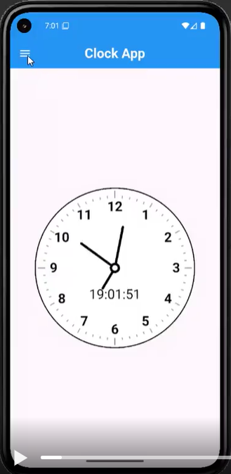
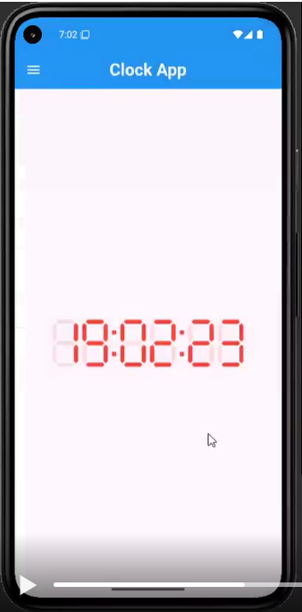
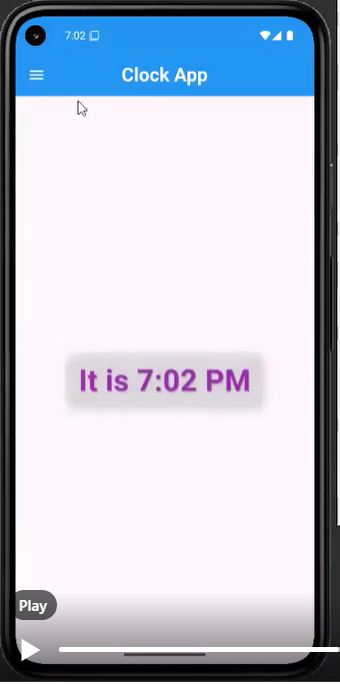
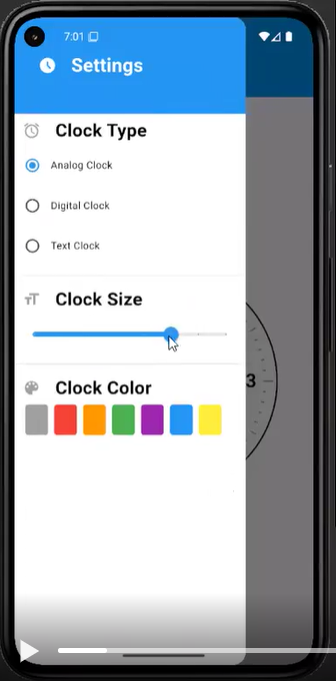

# 🕒 Clock App

A dynamic and customizable **Clock App** built using Flutter as part of my role as **Vice Head of Flutter at GDG Al-Azhar** 
This app offers users a sleek and interactive way to switch between various clock styles and customize the appearance to their liking.

---

## 📸 Screenshots

<p float="left">
  
  
  
  
</p>

---

## ✨ Features

- ✅ Switch between **Analog**, **Digital**, and **Text** clocks
- 🎨 Customize clock color
- 📏 Adjust clock size
- 🔄 Real-time updates with smooth transitions

---

## 🚀 Getting Started

1. **Clone the repository:**
```bash
git clone https://github.com/karemthabet/clock_app.git
